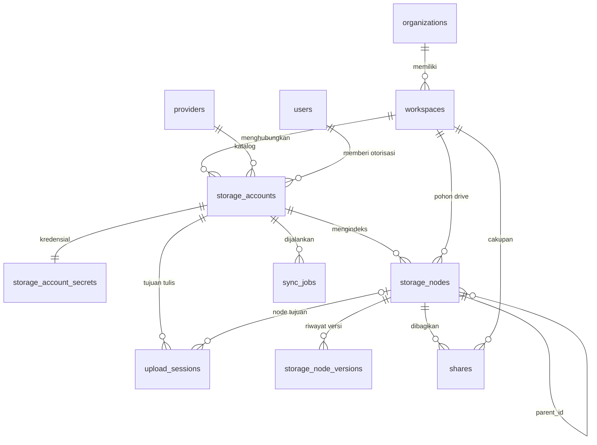

# ERD Cloud Storage Multi-Provider — buat dokumen desain

## Deliverable

Buat file **`docs/erd-cloud-storage.md`** berisi ERD (Mermaid) + spesifikasi tabel + keputusan desain.
**Belum ada migrasi/kode** pada tahap ini — ini desain dulu sesuai permintaan; migrasi `000004_create_storage_domain_schema` menyusul setelah ERD disetujui.

## Keputusan desain (sudah dikonfirmasi)

1. **`providers`** = katalog tipe provider global (google_drive, onedrive, dropbox, s3_compatible, ...) dengan protokol/auth + kapabilitas JSONB. Menyempurnakan model `Provider` yang selama ini direferensikan kode tapi tak pernah dimigrasi.
2. **`storage_accounts`** = akun provider yang terkoneksi — "1 provider bisa banyak akun". **Terikat langsung ke 1 workspace** (keputusan user), kredensial dipisah ke `storage_account_secrets` (1:1, terenkripsi, `key_id` untuk rotasi).
3. **Folder root per akun** di dalam drive terpadu per workspace (keputusan user): saat akun aktif, dibuat node mount-root (`source_id` = akun, `remote_id` NULL); isi provider terindeks di bawahnya. Node native Cloudrive: `source_id` NULL.
4. **`storage_nodes`** = satu pohon folder+file terpadu per workspace (self-referencing `parent_id`), zero-copy: hanya metadata/indeks. Disconnect akun = CASCADE menghapus indeksnya.
5. **`storage_node_versions`** = timeline versi terpadu; **`shares`** = berbagi (token, password opsional, expired/revoke); **`sync_jobs`** = status sinkronisasi dengan cursor incremental; **`upload_sessions`** = satu-satunya alur penulisan data fisik.
6. Semua tabel bertenant membawa `organization_id` + composite FK `(workspace_id, organization_id) → workspaces(id, organization_id)` — kelanjutan pola migrasi `000003`, siap RLS.

## ERD (inti — mermaid, lengkap di file)

## Constraint kunci per tabel (detail lengkap di file)

- **providers**: `slug` UNIQUE; CHECK `protocol`/`auth_type`; `capabilities` JSONB; `is_active`.
- **storage_accounts**: UNIQUE `(workspace_id, provider_id, external_account_id)`; FK composite → workspaces CASCADE, `provider_id` RESTRICT, `owner_user_id` RESTRICT; `status` CHECK (pending_auth/active/expired/revoked/error); soft delete = disconnect.
- **storage_account_secrets**: PK = FK `storage_account_id` (1:1); `credentials_encrypted bytea` + `key_id`.
- **storage_nodes**: FK `source_id` CASCADE, `parent_id` self-CASCADE; UNIQUE `(source_id, remote_id)`; unique nama dalam folder via `COALESCE` (folder root mount & root workspace); index `(workspace_id, parent_id)`, `content_hash`, partial `trashed_at`; `metadata` JSONB.
- **storage_node_versions**: FK composite `(node_id, organization_id, workspace_id)` → butuh `UNIQUE(id, organization_id, workspace_id)` di storage_nodes; UNIQUE `(node_id, source_version_id)`; index `(node_id, modified_at DESC)`.
- **shares**: `token` UNIQUE; partial index untuk link aktif (`revoked_at IS NULL` dan belum expired).
- **sync_jobs**: index `(storage_account_id, status)` + partial index antrean `WHERE status IN ('queued','running')`.
- **upload_sessions**: parent_node_id CASCADE; status CHECK; `bytes_uploaded` progres.

## Alur utama yang didokumentasikan

connect akun → sync (full/incremental, cursor) → browse/search (tsvector generated column sebagai opsi v1) → share → disconnect (cascade indeks) → upload eksplisit.

## Sisa pertanyaan terbuka (dicatat di file, tidak memblokir ERD)

- Trash terpadu global vs per akun (kolom `trashed_at` sudah mendukung keduanya).
- Dedup lintas akun via `content_hash` — v1 atau belakangan.
- Pencarian: full-text Postgres vs engine terpisah (Meilisearch/Typesense).

## Verifikasi

File ERD dibuat dan dapat dirender (Mermaid) di GitHub/IDE; tidak ada perubahan kode atau database pada tahap ini.