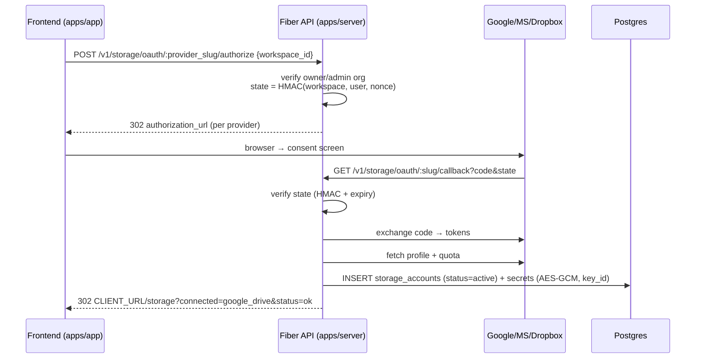

# PRD — Koneksi Provider Storage (Google Drive, Dropbox, OneDrive) di `apps/server`

> Status: **Draft v1** · Tanggal: 2026-09-23 · Referensi: [OmniCloud](https://github.com/masb0ymas/OmniCloud) `backend/src` (adapters, *OAuthService, accountService)
> Lingkup: OAuth connect flow di server + konektor per provider + audit database design. Mega di-backlog (lihat §8).

---

## 1. Ringkasan

Cloudrive harus bisa **menghubungkan akun Google Drive, Dropbox, dan OneDrive** ke sebuah workspace tanpa pernah
mengekspos token OAuth ke frontend. OmniCloud menyelesaikan ini dengan pola 3 lapis:

| Lapis OmniCloud | Analogi di cloudrive | Status |
| --- | --- | --- |
| `services/*OAuthService.js` (`createXxxAuthorizationRequest`, `completeXxxAccountLink`) | `internal/services/provideroauth` (baru) | ❌ belum ada |
| `adapters/*Adapter.js` (interface `BaseCloudAdapter`) | `internal/connectors` (interface `Connector`, S3-shaped) | 🟡 ada `s3_compatible`, `google_drive`; perlu `dropbox`, `onedrive` |
| `services/adapterRegistry.js` (map provider → adapter) | `connectors/registry.go` `Registry.New()` switch `provider.Protocol` | 🟡 ada, tinggal perluas |
| `upsertCloudAccount` + `encryptJson` (AES-256-GCM) | `StorageAccountRepository` + `storage_account_secrets` + `SecretBox` | ✅ sudah lebih baik dari OmniCloud |

Perbedaan fundamental yang harus dipertahankan di cloudrive (jangan meniru mentah-mentah):
1. **Multi-tenant**: OmniCloud mengikat akun ke `user_id`; cloudrive mengikat ke `(workspace_id, organization_id)`
   dengan `owner_user_id` sebagai pemberi consent.
2. **Server-side stateless registry**: OmniCloud membuat adapter per request; cloudrive `Registry.New()` juga stateless —
   token akses di-refresh per request via `oauth2.TokenSource` (Go stdlib). Jangan cache access token ke DB.
3. **Vault terenkripsi dengan `key_id`** (rotasi kunci): OmniCloud hanya punya satu kunci (`env.encryptionKey`).

## 2. Tujuan

- Pengguna (owner/admin org) menghubungkan akun GDrive/Dropbox/OneDrive lewat **OAuth authorization-code flow yang
  di-host server**; kredensial hanya menyentuh server.
- Kredensial tersimpan terenkripsi (AES-256-GCM) di `storage_account_secrets` dengan `key_id` untuk rotasi.
- Koneksi terverifikasi: sebelum `status = 'active'`, server memvalidasi token dengan mem-fetch profil + kuota
  (`drive.about.get` / Dropbox `users.get_current_account` / Graph `me/drive?$select=quota`).
- Satu provider bisa punya beberapa akun per workspace (unique constraint sudah ada).
- Akun yang terhubung bisa dinonaktifkan (`expired`/`revoked`) tanpa menghapus indeks `storage_nodes`.

Non-goal (v1): upload/download via unified tree, `storage_nodes` indexing, Mega, WebDAV/FTP, trash sync.

## 3. Arsitektur



### 3.1 Endpoint baru (`cmd/api/routes.go`)

| Method | Path | Handler | Auth |
| --- | --- | --- | --- |
| `POST` | `/v1/storage/oauth/:provider_slug/authorize` | `StorageAccountOAuth.Authorize` | bearer + org owner/admin |
| `GET` | `/v1/storage/oauth/:provider_slug/callback` | `StorageAccountOAuth.Callback` | public (dipanggil provider), diamankan via `state` HMAC |
| `POST` | `/v1/storage/accounts/:accountId/refresh` | `StorageAccountOAuth.Refresh` | bearer + org owner/admin |
| `GET` | `/v1/storage/accounts/:accountId/quota` | `StorageAccountOAuth.Quota` | bearer + org member |

`authorize` mengembalikan `{ authorization_url, state, redirect_uri }` sebagai JSON; frontend yang me-redirect
(dibanding 302 langsung, supaya SPA bisa menampilkan UI "menghubungkan…").

### 3.2 Service baru: `internal/services/provideroauth`

Paket `provideroauth` berisi:
- `Session` — pembuat & verifikator `state` (HMAC-SHA256 dengan `APP_SECRET`; payload = workspace_id + user_id +
  provider_slug + nonce + exp, base64url). Mengganti `Map` in-memory OmniCloud yang tidak survive restart dan tidak
  multi-instance.
- `Flow` per provider: `AuthorizationURL(state) string`, `Exchange(ctx, code) (Credentials, error)`,
  `Profile(ctx, creds) (Profile, error)`.

| Provider | Authorization endpoint | Token endpoint | Scopes (v1) |
| --- | --- | --- | --- |
| `google_drive` | `accounts.google.com/o/oauth2/v2/auth` `access_type=offline&prompt=consent` | `oauth2.googleapis.com/token` | `openid email profile https://www.googleapis.com/auth/drive.readonly` + `drive.file` (gdrive.go butuh full drive untuk upload) |
| `onedrive` | `login.microsoftonline.com/{tenant}/oauth2/v2.0/authorize` | sama, `/token` | `offline_access Files.ReadWrite.All User.Read` |
| `dropbox` | `www.dropbox.com/oauth2/authorize` `token_access_type=offline` | `api.dropboxapi.com/oauth2/token` | `account_info.read files.metadata.read files.content.read files.content.write` |

Konfigurasi env/flag (mengikuti pola `flag.go` → `config.go` → `entrypoint.sh`):
`ONEDRIVE_CLIENT_ID`, `ONEDRIVE_CLIENT_SECRET`, `ONEDRIVE_TENANT_ID` (default `common`),
`DROPBOX_CLIENT_ID`, `DROPBOX_CLIENT_SECRET`, plus redirect URI derived:
`SERVER_URL + "/v1/storage/oauth/<slug>/callback"`.
`GOOGLE_CLIENT_ID/SECRET` sudah ada — dipakai ulang.

### 3.3 Kredensial per provider (isi `storage_account_secrets.credentials_encrypted` setelah didekripsi)

```jsonc
// google_drive — dipakai gdrive.go (sudah): refresh_token wajib
{ "refresh_token": "...", "access_token": "...", "expires_at": "RFC3339", "scope": "..." }

// onedrive
{ "refresh_token": "...", "access_token": "...", "expires_at": "...", "drive_id": "...", "drive_type": "personal|business" }

// dropbox — token berlaku 4 jam, wajib refresh
{ "refresh_token": "...", "access_token": "...", "expires_at": "...", "account_id": "dbid:..." }
```

Kontrak penting dari OmniCloud: kalau `refresh_token` kosong setelah exchange → **gagalkan koneksi** (Dropbox dan
Google `prompt=consent` harus selalu memberi refresh token). Jangan pernah menyimpan access token tanpa refresh token.

### 3.4 Perluasan registry & konektor

`connectors/registry.go`:
- Tambah konfigurasi `DropboxClientID/Secret`, `OneDriveClientID/Secret/TenantID` di samping Google.
- Tambah case `"dropbox"`, `"onedrive"` → `newDropboxConnector`, `newOneDriveConnector` (masing-masing punya
  `oauth2.Config` + `oauth2.TokenSource` internal, pola sama seperti `gdrive.go:60-90`).

Konektor baru mengimplementasikan `Connector` (S3-shaped, bukan interface gaya OmniCloud):
- **Dropbox**: `PutObject` = `POST content.dropboxapi.com/2/files/upload` (≤150 MB per call; > itu pakai
  `upload/start` → `append_v2` → `finish` yang cocok dengan `CreateMultipartUpload`/`UploadPart`/`Complete`);
  `GetObject` = `POST .../files/download` (`Dropbox-API-Arg` header); `ListObjects` = `files/list_folder` +
  `list_folder/continue` (page token jadi continuation token); `StatObject` = `files/get_metadata`.
- **OneDrive**: `PutObject` = Graph `PUT /drives/{driveId}/items/{parent}:/{name}:/content` (≤250 MB; > itu
  upload session `POST .../createUploadSession` → potongan 5–10 MB); `GetObject` = `GET .../content`;
  `ListObjects` = `GET /drives/{driveId}/items/{parent}/children?$top` + `@odata.nextLink`.
- Drive & Dropbox tidak punya direktori sungguhan / delimiter S3 — ikuti pola `gdrive.go`: flat dengan path →
  remote-id cache, delimiter dikosongkan di gateway callers.

### 3.5 Status & error handling

- Exchange token / profile gagal → `storage_accounts.status = 'error'`, response callback tetap redirect ke
  frontend dengan `?status=error&reason=...` (tidak pernah mem-bocorkan pesan provider mentah).
- Connector yang mendapat 401 saat operasi file → refresh token otomatis via `TokenSource`; kalau refresh gagal →
  handler menandai akun `expired` (OmniCloud: `invalid_token`).
- Log tidak pernah memuat token/ciphertext.

## 4. Model data

Tidak ada migrasi baru untuk flow ini. Reuse `providers` (slug), `storage_accounts` (unique
`(workspace_id, provider_id, external_account_id)`), `storage_account_secrets` (AES-256-GCM + `key_id`).
`external_account_id` diisi dari profil provider (`profile.accountId` Dropbox, `driveId` OneDrive, Google pakai
email/`driveId`). Mount-root `storage_nodes` dibuat saat konektor pertama dipakai (fase sync, bukan fase connect).

Seeder: tambahkan `auth_type: 'oauth2'`, `protocol: 'oauth2_cloud'` untuk `google_drive`, `onedrive`, `dropbox`
(sudah ada di `seeders/provider.go`) — tidak berubah.

## 5. Acceptance criteria

1. `make db/migrations/seed && make run` dengan `GOOGLE_CLIENT_ID/SECRET`, `DROPBOX_CLIENT_ID/SECRET`,
   `ONEDRIVE_CLIENT_ID/SECRET` terisi → `GET /v1/providers` menampilkan ketiganya dengan `auth_type=oauth2`.
2. `POST /v1/storage/oauth/google_drive/authorize` dengan bearer token org owner → 200, body berisi
   `authorization_url` yang mengandung `state` dan `redirect_uri` benar.
3. Menyelesaikan consent → callback mengembalikan redirect `CLIENT_URL` + `storage_accounts` berstatus `active`
   dengan `account_email` benar; `storage_account_secrets` terisi ciphertext (tak ada plaintext di DB).
4. Mengulang connect untuk akun yang sama di workspace yang sama → 200 dengan update (bukan duplikat), karena
   unique constraint.
5. `GET /v1/storage/accounts/:id/quota` → `total_space`/`used_space` real dari provider.
6. Callback dengan `state` palsu/expired → redirect error, tidak ada row ditulis.
7. Non-owner/admin org → `POST authorize` ditolak 403.
8. Revoke akun di sisi provider → operasi berikutnya menandai akun `expired` (dicek via smoke test manual).

## 6. Rencana kerja

| # | Item | File |
| --- | --- | --- |
| 1 | Config & flag: OneDrive/Dropbox client, redirect URI derivation | `internal/config/config.go`, `cmd/api/flag.go`, `scripts/entrypoint.sh`, `.env.example` |
| 2 | `provideroauth` service: state HMAC, Flow GDrive/Dropbox/OneDrive, Exchange/Profile | `internal/services/provideroauth/*.go` (baru) |
| 3 | Handlers `Authorize` / `Callback` / `Refresh` / `Quota` + wiring routes | `internal/handlers/storage_account_oauth.go` (baru), `cmd/api/routes.go` |
| 4 | Registry: tambahkan dropbox/onedrive + config | `internal/connectors/registry.go` |
| 5 | Konektor `dropbox.go`, `onedrive.go` (mulai dari GetObject/StatObject/ListObjects/PutObject, multipart menyusul) | `internal/connectors/*.go` |
| 6 | Error → status mapping (401 → `expired`) di gateway & handler | `internal/services/s3/errors.go`, `internal/connectors` |
| 7 | Smoke test end-to-end dengan kredensial dev provider + unit test state HMAC & exchange mock | `provideroauth/*_test.go`, `connectors/*_test.go` |

## 7. Risiko & mitigasi

| Risiko | Mitigasi |
| --- | --- |
| Google/Dropbox kadang tidak mengembalikan refresh token | Wajib `prompt=consent` / `token_access_type=offline`; gagalkan connect kalau kosong (pola OmniCloud `completeDropboxAccountLink`) |
| Callback tanpa sesi (provider redirect langsung) | `state` HMAC + expiry 10 menit, tanpa server-side session store |
| Token bocor ke log/telemetri | Redact di logger; `credentials_encrypted` tidak pernah di-`c.JSON` |
| Dropbox/OneDrive tidak mendukung multipart S3 semantik | Dropbox pakai `upload/start|append|finish`, OneDrive pakai upload session; keduanya dipetakan ke `CreateMultipartUpload`/`UploadPart`/`Complete` |
| Rate limit provider saat sync besar | Out of scope v1 (sync belum ada); sync_jobs sudah didesain di ERD |

## 8. Mega (backlog, risiko eksplisit)

OmniCloud pakai `megajs` (email+password+optional 2FA → session JSON tersimpan). **Tidak ada SDK Go yang matang**;
menulis protokol MEGA sendiri berarti mengimplementasikan PBKDF2 key derivation, AES-CBC/ECB, RSA untuk share key,
dan chunked upload terenkripsi — 1–2 minggu kerja berisiko. Putusan: **Fase 2**; kalau tetap dibutuhkan, evaluasi
porting minimal dari `megajs` (login + file tree + upload/download) atau jalankan microservice Node kecil yang
mengekspos antarmuka `Connector` via gRPC/HTTP.

## 9. Audit database design (migrasi `000004`, `000005`, ERD `docs/erd-cloud-storage.md`)

Kesimpulan: **desain sudah lebih baik dari OmniCloud** (vault terenkripsi terpisah + `key_id`, multi-tenant composite
FK, JSONB capabilities, soft delete). Temuan berikut adalah perbaikan yang **direkomendasikan** sebelum fase sync
dimulai; tidak ada yang memblokir fase connect.

### 9.1 Temuan (prioritas tinggi)

1. **`storage_accounts.account_email` bukan `NOT NULL`** — OmniCloud selalu mengisi email (`profile.email` wajib).
   Untuk GDrive/Dropbox/OneDrive profil email selalu ada; saran: tetap nullable (S3-compatible memang tidak punya
   email) tapi tambahkan **partial unique index**
   `CREATE UNIQUE INDEX ... ON storage_accounts (workspace_id, lower(account_email)) WHERE account_email IS NOT NULL`
   sebagai lapisan kedua di samping `external_account_id` — mencegah satu email provider terhubung dua kali ke
   workspace yang sama walau `external_account_id` beda format.
2. **Tidak ada `external_account_id` normalization**: Google pakai email, Dropbox `dbid:...`, OneDrive `driveId`.
   Tambahkan kolom `external_account_type` (mis. `email | dbid | drive_id | bucket`) ATAU normalisasi di level
   handler (prefiks konstan per provider) supaya unique constraint bermakna lintas provider. Rekomendasi: prefiks
   konstan di handler, tanpa kolom baru.
3. **`storage_nodes` belum dimigrasi** padahal ERD sudah matang dan fase sync bergantung padanya. Migrasi
   `000006_create_storage_node_schema` perlu sebelum konektor browse/sync dikirim. Item dari ERD yang harus
   dipertahankan: unique `(source_id, remote_id)`, unique nama per folder via `COALESCE`, index
   `(workspace_id, parent_id)`, partial `trashed_at`.
4. **`storage_node_versions` tanpa `retention`**: tanpa kebijakan, tabel membesar tanpa batas. Tambahkan (di ERD atau
   migrasi) `expires_at` atau pekerja pembersihan berbasis `capabilities.versioning` per provider.

### 9.2 Temuan (prioritas sedang)

5. **`storage_account_secrets.credentials_encrypted` bertipe `text`** dengan CHECK panjang — OmniCloud pakai base64
   string juga, jadi konsisten. Tapi format cloudrive `key_id:base64(nonce):base64(ct)` tidak ditegakkan DB. Tambahkan
   CHECK regex ringan atau biarkan dan andalkan repo-level test. Rekomendasi: biarkan (kunci format di repo test);
   menegakkan regex di DB hanya menambah noise.
6. **`sync_jobs` tidak punya `unique` antrean aktif per akun** — bisa terjadi dua `full_scan` berjalan bersamaan.
   Tambahkan partial unique index:
   `CREATE UNIQUE INDEX uq_sync_jobs_active_per_account ON sync_jobs (storage_account_id) WHERE status IN ('queued','running')`.
7. **`upload_sessions.bytes_uploaded` tanpa CHECK `bytes_uploaded <= size_bytes`** (omitable, tapi murah).
8. **`providers.capabilities` longgar** — OmniCloud punya `getCapabilities()` eksplisit (`starred`, `rename`,
   `delete`). Tambahkan JSON Schema-level validasi di seeder (bukan DB CHECK) dan dokumentasikan key baku:
   `versioning, trash, multipart, native_search, starred, rename, delete, max_file_size`.
9. **`shares.token` disimpan plaintext** (unique). OmniCloud tidak punya share. Kalau token dianggap seperti API key,
   simpan `token_hash` + tampilkan plaintext sekali. Rekomendasi: menyusul saat fitur share dibangun, bukan sekarang.
10. **Tidak ada tabel `storage_provider_oauth_states`** — dengan HMAC state (§3.2) memang tidak perlu; jangan ikuti
    pola OmniCloud Map in-memory. Catat di ERD agar tidak ditambahkan tanpa alasan.

### 9.3 Perbandingan dengan OmniCloud (ringkas)

| Aspek | OmniCloud | Cloudrive | Penilaian |
| --- | --- | --- | --- |
| Tenant | per user | per workspace/org (composite FK) | cloudrive lebih baik |
| Vault | `encrypted_credentials` di tabel akun | tabel terpisah + `key_id` rotasi | cloudrive lebih baik |
| Provider model | hardcoded map di `adapterRegistry` | tabel `providers` + capabilities JSONB | cloudrive lebih baik |
| File index | `file_metadata` SQLite | `storage_nodes` Postgres (belum dimigrasi) | OmniCloud sudah jalan; cloudrive harus segera migrasi |
| Sync | `node-cron` in-process | `sync_jobs` tabel + (nanti) worker | desain cloudrive lebih baik, eksekusi belum ada |
| Upload | WebSocket progress + session service | `upload_sessions` (desain) | setara, eksekusi belum ada |
| Koneksi OAuth | in-memory `Map` state | (rencana) HMAC state | cloudrive lebih aman untuk multi-instance |

## 10. Keputusan terbuka

1. Ijin OAuth Google: pakai `drive` penuh (seperti OmniCloud, untuk upload) atau `drive.file`/`drive.readonly` lebih
   sempit untuk v1? Rekomendasi: `drive` penuh agar konektor upload tidak perlu re-consent di fase berikutnya.
2. Callback redirect: JSON body (per §3.1) vs 302 langsung. Rekomendasi: JSON dari `authorize`, 302 dari `callback`.
3. Untuk OneDrive multi-akun business: apakah `tenant_id` per-provider cukup atau per-akun? Rekomendasi: per-provider
   (env), sama seperti OmniCloud.
